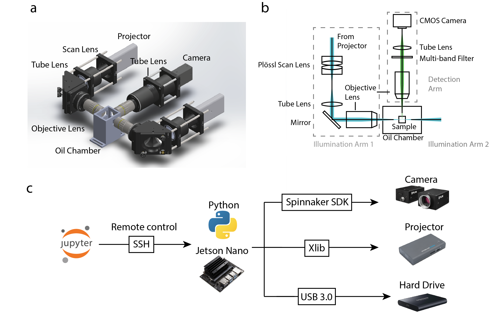

# pLSM
 Software control for projected light sheet microscopy

## Overview
Projected Light Sheet Microscopy (pLSM) offers a highly cost-optimized and scalable solution while maintaining excellent imaging quality. It leverages off-the-shelf components, including pocket LASER projectors as multi-color illumination sources, Nvidia Jetson Nano boards for electronic control, 3D-printed imaging chambers, optimized scan and detection optics and a plug-and-play architecture. It's capable of performing high-resolution multi-color imaging of large mouse and human brain samples cleared using various methods. 

#### Biorxiv Preprint here: https://www.biorxiv.org/content/10.1101/2023.05.31.543173v1

## Installation
### Nvidia Jetson Nano board with SD card (shareable system image will be available soon)
#### Python environment
- install Anaconda3
- create python3 environment
- install packages:
  - numpy
  - scipy
  - matplotlib
  - pandas
  - ipywidgets
  - pyfirmata
  - python-xlib https://pypi.org/project/python-xlib/

- install PySpin
  - Go to https://www.flir.com/products/spinnaker-sdk/ 
  - Install spinnaker SDK
  - Install spinnaker python interface following readme

### Remote control
#### Install latest Chrome
- Or ipywidgets won't work
#### Install PuTTY
