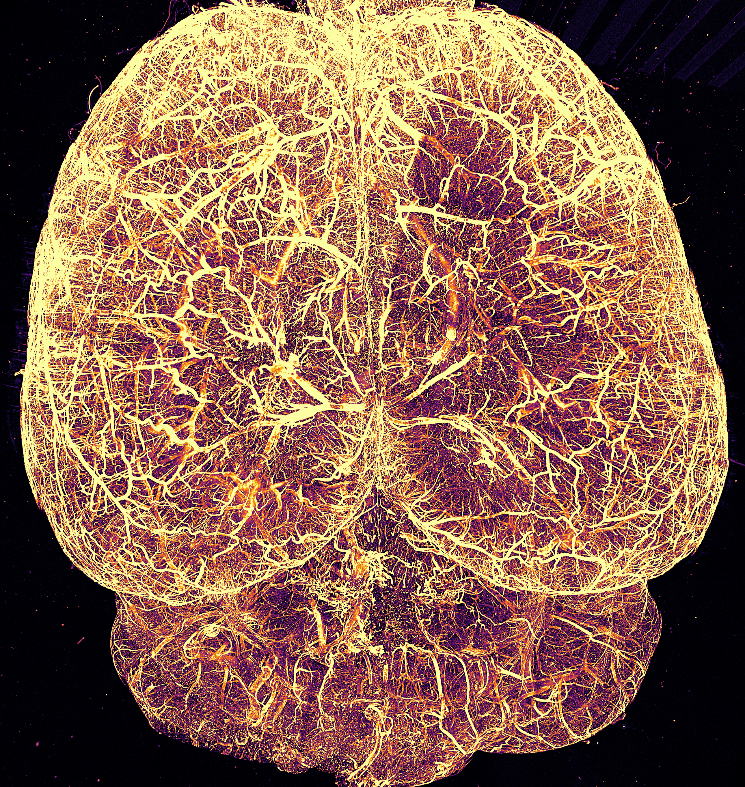

# pLSM: Affordable and scalable advanced light sheet microscopy

## Overview
pLSM framework 
Projected Light Sheet Microscopy (pLSM) framework is essentially about making cutting-edge light sheet microscopy capabilities broadly accessible, at a small fraction of cost with highly simplified mechanical, optical and computational footprints.
This is achieved by cleverly leveraging off-the-shelf components, such as inexpensive pocket LASER projectors as multi-color illumination sources, Nvidia Jetson Nano boards for electronic control, 3D-printed imaging chambers, optimized scan and detection optics and a plug-and-play architecture. 

#### Publication:
https://rdcu.be/dTCrk
\
https://www.nature.com/articles/s41551-024-01249-9
\
Nature Biomedical Engineering

## Installation (Further details in the Supplementary file in the publication)

Supplementary file provides details on the assembly process

### Nvidia Jetson Nano board SD card disk image for download:

#### Python environment
- install Anaconda3
- create python3 environment
- install packages:
  - numpy
  - scipy
  - matplotlib
  - pandas
  - ipywidgets
  - pyfirmata
  - python-xlib https://pypi.org/project/python-xlib/

- install PySpin
  - Go to https://www.flir.com/products/spinnaker-sdk/ 
  - Install spinnaker SDK
  - Install spinnaker python interface following readme

### Remote control
#### Install latest Chrome
- Or ipywidgets won't work
#### Install PuTTY

### Instructions for SD image installation and use:
1. Download the system disk image, burn it onto an SD card using Win32DiskImager/balenaEther or similar software of your choice. 

2. Insert the SD card into the Nvidia Nano Board (at this stage, the board should be connected to a monitor, keyboard, mouse, and Ethernet internet). 

3. Power up the board and log into the Ubuntu screen using the following: 
User: pLSM
Password: proj-lsm

4. Open a terminal window. Using ‘ifconfig’ command, determine the assigned the IP address assigned to the board. 

5. From any available desktop computer, establish an SSH connection using Putty (Windows, extensively tested by us) or Terminal (Mac) using the IP address of the nanoboard (from step 4).
Note, for Putty, type the IP address in the Host Name. Press ‘Open’, then log in using the above (step 3) username and password. If successful, it can be closed.

6. At this stage the monitor and keyboard but not mouse yet can be disconnected from the Nvidia nanoboard. Connect projectors on the HDMI and DP (note, it should be active DP wire) ports of the board. The power line of the projectors is recommended to connect to adapter and socket instead of Nvidia board USB as it might not have enough power to drive them. Once the projectors are connected, they will project the screen of the Ubuntu OS. Note: every time the display connection is changed (e.g. during a new installation), the system screen will have a toolbar jump out which will need to be moved down with the mouse, after which the toolbar will hide, resulting in a fully black screen. Mouse can be disconnected from the board at this stage.

7.  For Thorlabs stages, use any windows desktop computer to identify the serial numbers of the stages by installing and using Thorlabs APT software (needs to be done only once). The stages, along with the camera, are then connected to the Nvidia Nano Board vis USB. Note that an extra USB Hub might be needed and we recommend to connect stage control to the USB Hub, while the camera and hard drives should be directly connected on the board.

8. Further note on remote controlling the nanoboard Ubuntu system from another computer. 
Similar as step 5, but we also want to set up Jupyter notebook connection.
Putty: 
Type the IP address in the Host Name field. 
From the left side category, select Connection – SSH – Tunnels, type 8888 in Source Port (or any other port of your choice), 
Input Destination: localhost:8888 (or the port of your choice above). 
Click “Add”. Click “Open”.
Log in using Username: pLSM, password: proj-lsm. 

Open command line, type:
sudo sh -c 'echo 2000 > /sys/module/usbcore/parameters/usbfs_memory_mb'
Enter the password: proj-lsm (this is needed to set buffer)
cd /home/pLSM/Documents/python-xlib-master/plsm

source /home/pLSM/Documents/xlib_env/bin/activate
(activates the python environment)

jupyter-notebook --no-browser --port=8888 
(The port number used above. This activate Jupyter notebook server for remote access.)
This will provide the address to access and use the control Jupyter notebook.
